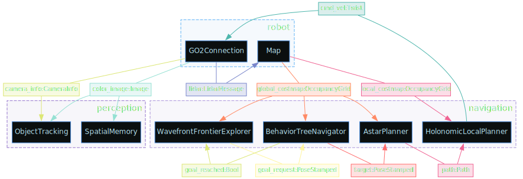
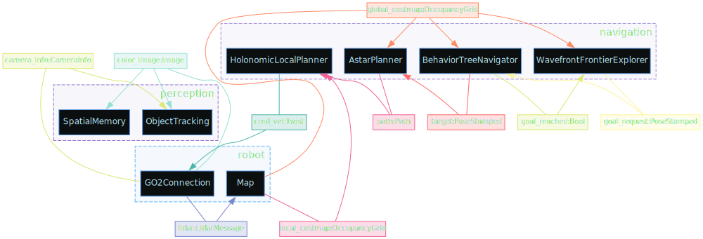
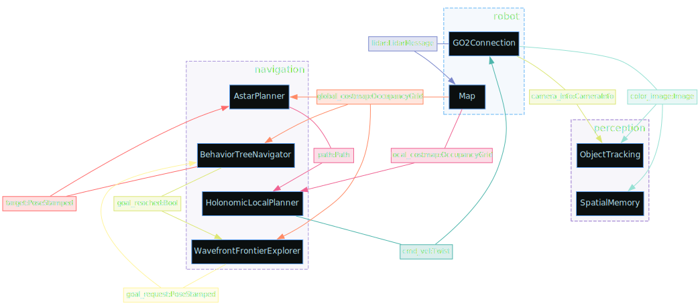
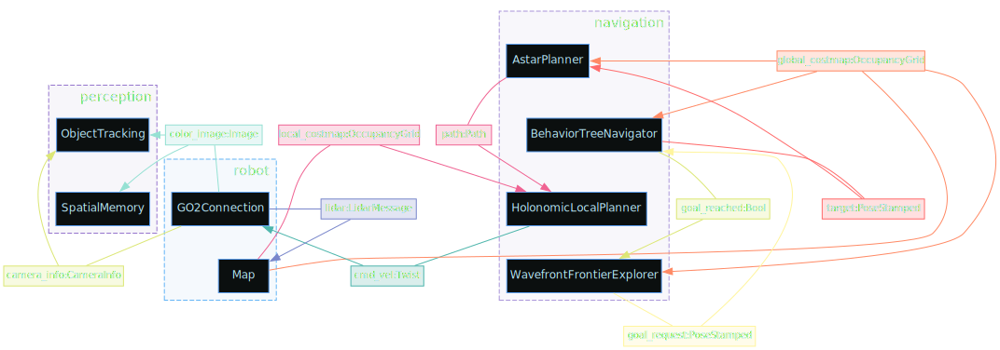
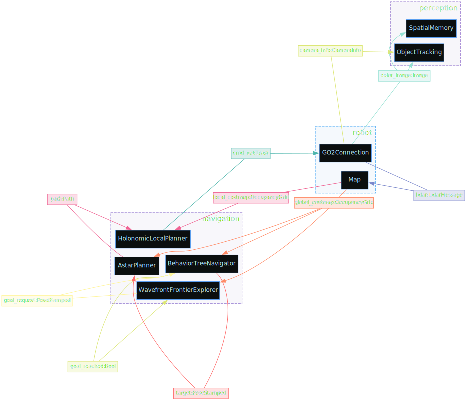
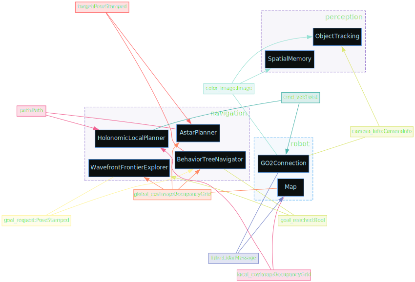
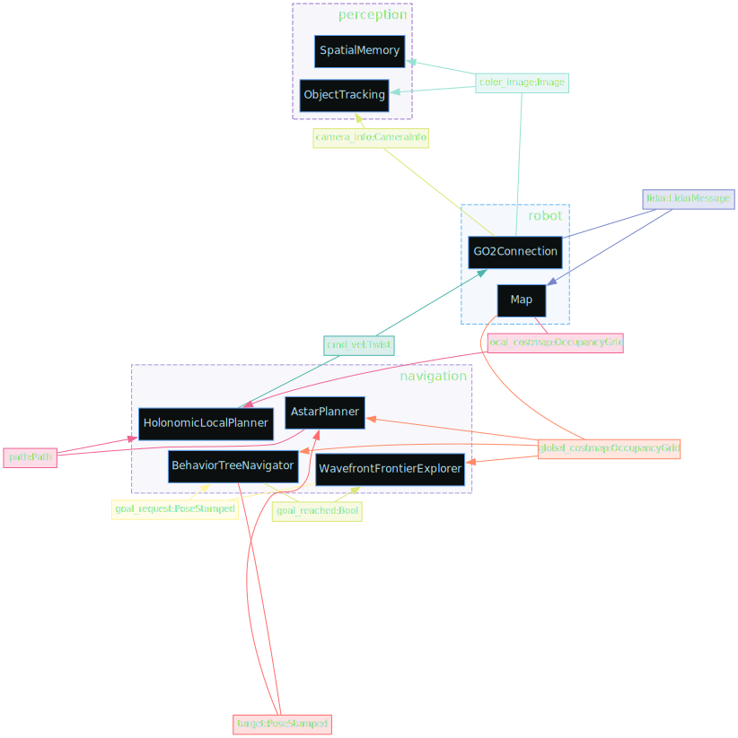
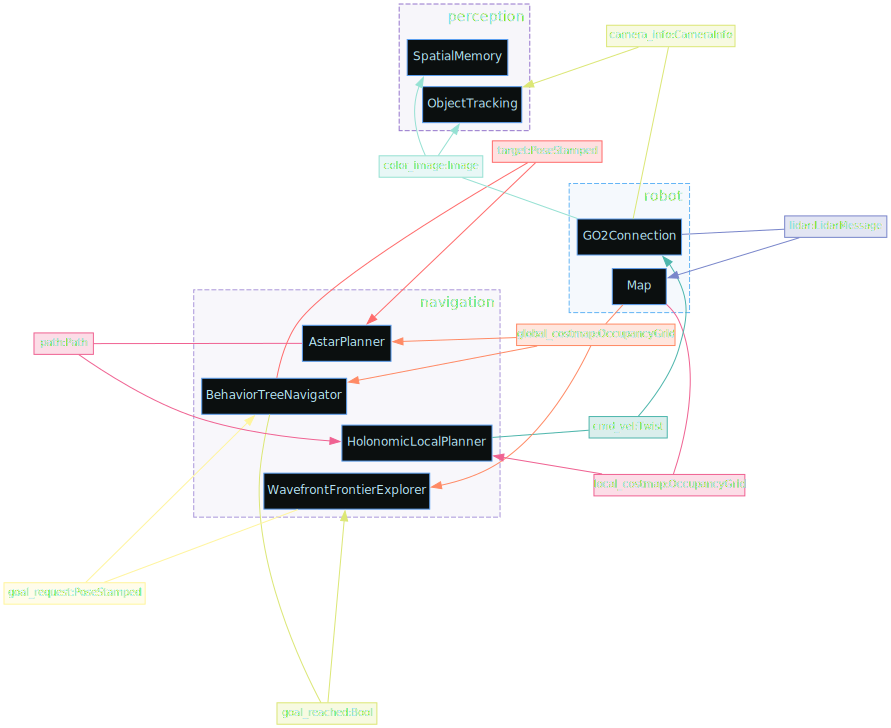

# Dimos Modules

Module is a subsystem on a robot that operates autonomously and communicates to other subsystems.
Some examples of are:

- Webcam (outputs image)
- Navigation (inputs a map and a target, outputs a path)
- Detection (takes an image and a vision model like yolo, outputs a stream of detections)

etc

## Example Module

```pythonx session=camera_module_demo ansi=false
from dimos.hardware.camera.module import CameraModule
print(CameraModule.io())
```

<!--Result:-->
```
┌┴─────────────┐
│ CameraModule │
└┬─────────────┘
 ├─ color_image: Image
 ├─ camera_info: CameraInfo
 │
 ├─ RPC start() -> str
 ├─ RPC stop() -> None
 │
 ├─ Skill video_stream (stream=passive, reducer=latest_reducer, output=image)
```

We can see that camera module outputs two streams:

color_image with [sensor_msgs.Image](https://docs.ros.org/en/melodic/api/sensor_msgs/html/msg/Image.html) type
camera_info with [sensor_msgs.CameraInfo](https://docs.ros.org/en/melodic/api/sensor_msgs/html/msg/CameraInfo.html) type

As well as offers two RPC calls, start and stop, and a tool for an agent called video_stream (about this later)

We can easily start this module and explore it's output

```pythonx session=camera_module_demo

camera = CameraModule()
# camera.io() returns the same result as above
camera.start()
# now this module runs in our main loop in a thread. we can observe it's outputs

camera.color_image.subscribe(print)
time.sleep(1)
camera.stop()
```

<!--Result:-->
```
<image>
<image>
<image>
```

## Blueprints

Blueprint is a structure of interconnected modules. basic unitree go2 blueprint looks like this,

```python  session=blueprints
from dimos.core.introspection.blueprint import dot2, LayoutAlgo
from dimos.robot.unitree_webrtc.unitree_go2_blueprints import basic, standard, agentic
```


```python session=blueprints output=go2_standard.svg
dot2.render_svg(standard, "{output}")
```

<!--Result:-->


```python session=blueprints output=go2_standard_stack_clusters.svg
dot2.render_svg(standard, "{output}", layout={LayoutAlgo.STACK_CLUSTERS})
```

<!--Result:-->


```python session=blueprints output=go2_standard_stack_nodes.svg
dot2.render_svg(standard, "{output}", layout={LayoutAlgo.STACK_NODES})
```

<!--Result:-->


```python session=blueprints output=go2_standard_stack_both.svg
dot2.render_svg(standard, "{output}", layout={LayoutAlgo.STACK_CLUSTERS, LayoutAlgo.STACK_NODES})
```

<!--Result:-->


```python session=blueprints output=go2_standard_fdp.svg
dot2.render_svg(standard, "{output}", layout={LayoutAlgo.FDP})
```

<!--Result:-->


```python session=blueprints output=go2_standard_fdp_stack_clusters.svg
dot2.render_svg(standard, "{output}", layout={LayoutAlgo.FDP, LayoutAlgo.STACK_CLUSTERS})
```

<!--Result:-->


```python session=blueprints output=go2_standard_fdp_stack_nodes.svg
dot2.render_svg(standard, "{output}", layout={LayoutAlgo.FDP, LayoutAlgo.STACK_NODES})
```

<!--Result:-->


```python session=blueprints output=go2_standard_fdp_stack_both.svg
dot2.render_svg(standard, "{output}", layout={LayoutAlgo.FDP, LayoutAlgo.STACK_CLUSTERS, LayoutAlgo.STACK_NODES})
```

<!--Result:-->

